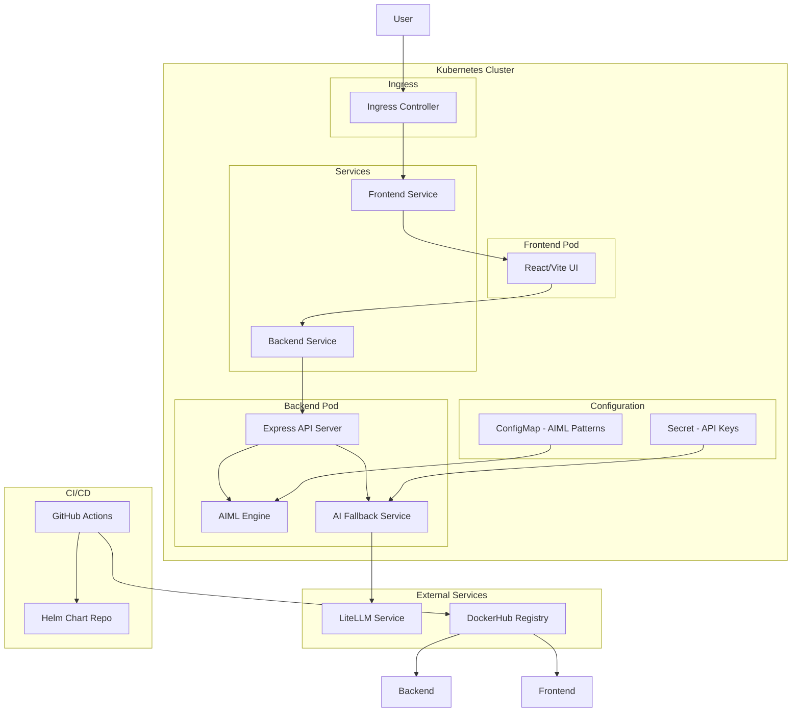

# Design Document: Kubernetes Chatbot

## Overview

The Kubernetes Chatbot is a containerized application that combines rule-based AIML pattern matching with AI-powered fallback responses. The system consists of a React frontend and a Node.js backend, deployed as separate services in Kubernetes with automated CI/CD through GitHub Actions.

The architecture follows a simple request-response pattern where user messages are first processed by an AIML engine for pattern matching. If no match is found, the system forwards the query to an external liteLLM service for AI-generated responses.

## Architecture



## Components and Interfaces

### Frontend Component (React/Vite)

**Responsibilities:**
- Render chat interface with message history
- Handle user input and form submission
- Display typing indicators and loading states
- Provide admin panel for viewing AIML patterns and system status
- Responsive design for desktop and mobile

**Key Interfaces:**
- REST API client for backend communication
- WebSocket connection for real-time updates (optional enhancement)
- Local state management for conversation history

**Technology Stack:**
- React 18 with TypeScript
- Vite for build tooling and development server
- Tailwind CSS for styling
- Axios for HTTP requests

### Backend Component (Node.js/Express)

**Responsibilities:**
- Expose REST API endpoints for chat and admin operations
- Coordinate between AIML engine and AI fallback service
- Handle health checks and system monitoring
- Manage configuration loading from ConfigMaps

**API Endpoints:**
```
POST /api/chat
  Body: { message: string, sessionId?: string }
  Response: { response: string, source: 'aiml' | 'ai', sessionId: string }

GET /api/admin/patterns
  Response: { patterns: AimlPattern[] }

GET /api/admin/status
  Response: { aimlLoaded: boolean, litellmConnected: boolean, uptime: number }

GET /health
  Response: { status: 'healthy' | 'unhealthy', timestamp: string }
```

### AIML Engine

**Responsibilities:**
- Parse and load AIML pattern files from ConfigMap
- Match user input against loaded patterns using pattern matching algorithms
- Return appropriate template responses with variable substitution
- Support basic AIML tags: `<category>`, `<pattern>`, `<template>`, `<srai>`

**Pattern Matching Algorithm:**
1. Normalize input (lowercase, trim whitespace)
2. Iterate through patterns by priority (specific to general)
3. Use wildcard matching for `*` and `_` symbols
4. Return first matching template with variable substitution

**AIML Structure:**
```xml
<aiml>
  <category>
    <pattern>HELLO</pattern>
    <template>Hi there! How can I help you?</template>
  </category>
  <category>
    <pattern>WHAT IS YOUR NAME</pattern>
    <template>I'm a helpful chatbot assistant.</template>
  </category>
  <category>
    <pattern>* WEATHER *</pattern>
    <template>I don't have weather information, but I can help with other questions!</template>
  </category>
</aiml>
```

### AI Fallback Service

**Responsibilities:**
- Integrate with external liteLLM service via HTTP API
- Handle authentication and request formatting for liteLLM
- Manage conversation context and session state
- Provide graceful error handling when liteLLM is unavailable

**LiteLLM Integration:**
```javascript
// Example integration pattern
const liteLLMRequest = {
  model: "gpt-3.5-turbo",
  messages: [
    { role: "system", content: "You are a helpful assistant." },
    { role: "user", content: userMessage }
  ],
  max_tokens: 150,
  temperature: 0.7
};
```

## Data Models

### Message Model
```typescript
interface ChatMessage {
  id: string;
  content: string;
  timestamp: Date;
  source: 'user' | 'aiml' | 'ai';
  sessionId: string;
}
```

### AIML Pattern Model
```typescript
interface AimlPattern {
  id: string;
  pattern: string;
  template: string;
  priority: number;
  category?: string;
}
```

### Session Model
```typescript
interface ChatSession {
  id: string;
  messages: ChatMessage[];
  createdAt: Date;
  lastActivity: Date;
}
```

### System Status Model
```typescript
interface SystemStatus {
  aimlEngine: {
    loaded: boolean;
    patternCount: number;
    lastReload: Date;
  };
  liteLLM: {
    connected: boolean;
    lastCheck: Date;
    responseTime?: number;
  };
  uptime: number;
}
```

## Correctness Properties

*A property is a characteristic or behavior that should hold true across all valid executions of a system-essentially, a formal statement about what the system should do. Properties serve as the bridge between human-readable specifications and machine-verifiable correctness guarantees.*

### Property 1: AIML Pattern Loading
*For any* valid AIML configuration file, loading it at startup should result in all patterns being available for matching
**Validates: Requirements 1.1**

### Property 2: Pattern Matching Attempt
*For any* user input, the AIML engine should attempt to match it against all loaded patterns
**Validates: Requirements 1.2**

### Property 3: Template Response Generation
*For any* pattern that matches user input, the AIML engine should return the corresponding template response
**Validates: Requirements 1.3**

### Property 4: AIML Tag Support
*For any* AIML file containing basic tags (pattern, template, category), the parser should successfully process all elements
**Validates: Requirements 1.4**

### Property 5: Pattern Priority Resolution
*For any* user input that matches multiple patterns, the AIML engine should return the response from the most specific pattern
**Validates: Requirements 1.5**

### Property 6: AI Fallback Activation
*For any* user input that produces no AIML pattern matches, the system should forward the question to the AI fallback service
**Validates: Requirements 2.1**

### Property 7: LiteLLM API Integration
*For any* valid API request, the AI fallback service should successfully communicate with the liteLLM service using the HTTP API
**Validates: Requirements 2.2**

### Property 8: AI Response Formatting
*For any* response received from liteLLM, the AI fallback service should format and return it to the user
**Validates: Requirements 2.3**

### Property 9: Conversation Context Preservation
*For any* conversation session, the AI fallback service should include relevant context when forwarding questions to liteLLM
**Validates: Requirements 2.5**

### Property 10: Chat Interface Message Display
*For any* chat session, the interface should display all messages in chronological order with proper formatting
**Validates: Requirements 3.1, 3.3**

### Property 11: Message Transmission
*For any* user message input, pressing Enter should trigger transmission to the backend API
**Validates: Requirements 3.2**

### Property 12: UI State Management
*For any* pending response, the chat interface should display typing indicators until the response is received
**Validates: Requirements 3.4**

### Property 13: Session History Persistence
*For any* chat session, all messages should remain visible throughout the session duration
**Validates: Requirements 3.5**

### Property 14: Responsive Design
*For any* screen size within the supported range, the chat interface should adapt its layout appropriately
**Validates: Requirements 3.6**

### Property 15: Admin Pattern Display
*For any* loaded AIML patterns, the admin panel should display them accurately with their current content
**Validates: Requirements 4.1**

### Property 16: System Status Reporting
*For any* system state, the admin panel should display current health status of all services
**Validates: Requirements 4.2**

### Property 17: Kubernetes Deployment Structure
*For any* deployment using the Helm chart, it should create exactly one frontend and one backend deployment
**Validates: Requirements 5.1**

### Property 18: Network Configuration
*For any* Kubernetes deployment, services and ingress should be configured to enable external access
**Validates: Requirements 5.2**

### Property 19: Scaling Configuration
*For any* deployment, HPA should be configured to support 1-2 replicas with appropriate scaling metrics
**Validates: Requirements 5.3**

### Property 20: Health Monitoring
*For any* deployed pod, it should include properly configured health checks and readiness probes
**Validates: Requirements 5.4**

### Property 21: Image Repository Configuration
*For any* deployment, all container images should reference the elevy99927 DockerHub repository as defined in values.yaml
**Validates: Requirements 5.5**

### Property 22: Configuration Management
*For any* deployment, AIML patterns and application settings should be managed through ConfigMaps
**Validates: Requirements 5.6**

### Property 23: CI/CD Pipeline Triggering
*For any* commit to the main branch, the automated build pipeline should be triggered
**Validates: Requirements 6.1**

### Property 24: Image Build and Publish
*For any* successful pipeline run, Docker images should be built and pushed to the elevy99927 DockerHub repository
**Validates: Requirements 6.2**

### Property 25: Helm Chart Publishing
*For any* successful pipeline run, updated Helm charts should be published to the GitHub repository
**Validates: Requirements 6.3**

### Property 26: Pipeline Testing Integration
*For any* pipeline execution, automated tests should run and pass before image creation
**Validates: Requirements 6.4**

### Property 27: Image Tagging
*For any* built image, it should be tagged with both commit SHA and version number
**Validates: Requirements 6.5**

### Property 28: API Communication
*For any* frontend operation, communication with the backend should use the defined REST API endpoints
**Validates: Requirements 7.1**

### Property 29: API Endpoint Availability
*For any* backend deployment, all required endpoints (chat, admin, health) should be accessible and functional
**Validates: Requirements 7.2**

### Property 30: Startup Connectivity Validation
*For any* system startup with liteLLM configured, the AI fallback service should validate connectivity before accepting requests
**Validates: Requirements 7.3**

### Property 31: Interaction Logging
*For any* user interaction, the system should generate appropriate log entries for debugging and monitoring
**Validates: Requirements 7.4**

## Error Handling

### Network Failure Handling
- **Graceful Degradation**: When liteLLM is unavailable, the system continues operating with AIML-only responses
- **User Feedback**: Clear error messages inform users when AI features are temporarily unavailable
- **Retry Logic**: Automatic retry with exponential backoff for transient network failures
- **Circuit Breaker**: Prevent cascading failures by temporarily disabling liteLLM integration after repeated failures

### AIML Processing Errors
- **Pattern Loading Failures**: Log errors and continue with successfully loaded patterns
- **Malformed AIML**: Validate AIML syntax and skip invalid patterns with detailed error logging
- **Template Processing**: Handle template variable substitution errors gracefully

### API Error Responses
- **Validation Errors**: Return structured error responses with specific field validation messages
- **Authentication Failures**: Proper HTTP status codes and error descriptions
- **Rate Limiting**: Implement request throttling with appropriate error responses

### Frontend Error Handling
- **Network Connectivity**: Display connection status and retry options
- **API Failures**: Show user-friendly error messages with suggested actions
- **State Recovery**: Maintain conversation history even after temporary failures

## Testing Strategy

### Dual Testing Approach
The system will use both unit testing and property-based testing to ensure comprehensive coverage:

- **Unit Tests**: Verify specific examples, edge cases, and error conditions
- **Property Tests**: Verify universal properties across all inputs using randomized testing
- Both approaches are complementary and necessary for comprehensive validation

### Property-Based Testing Configuration
- **Testing Framework**: Use fast-check for JavaScript/TypeScript property-based testing
- **Test Iterations**: Minimum 100 iterations per property test to ensure thorough coverage
- **Test Tagging**: Each property test tagged with format: **Feature: kubernetes-chatbot, Property {number}: {property_text}**

### Unit Testing Focus Areas
- **AIML Parser**: Test specific pattern matching scenarios and edge cases
- **API Endpoints**: Test request/response handling and validation
- **Error Conditions**: Test specific failure scenarios and recovery mechanisms
- **Integration Points**: Test component interactions and data flow

### Testing Categories

#### AIML Engine Testing
- Pattern matching accuracy with various input formats
- Template variable substitution
- Priority-based pattern selection
- Malformed AIML handling

#### AI Fallback Service Testing
- liteLLM API integration and error handling
- Context preservation across conversation turns
- Graceful degradation when external service unavailable
- Response formatting and validation

#### Frontend Testing
- User interaction flows and state management
- API communication and error handling
- Responsive design across different screen sizes
- Admin panel functionality

#### Integration Testing
- End-to-end conversation flows
- Configuration loading and hot-reloading
- Health check and monitoring endpoints
- Kubernetes deployment validation

#### CI/CD Pipeline Testing
- Build process validation
- Image tagging and publishing
- Helm chart generation and validation
- Automated test execution

### Performance Testing
- **Load Testing**: Validate system performance under expected user loads
- **Response Time**: Ensure chat responses meet acceptable latency requirements
- **Resource Usage**: Monitor memory and CPU usage under various loads
- **Scalability**: Test HPA scaling behavior under load