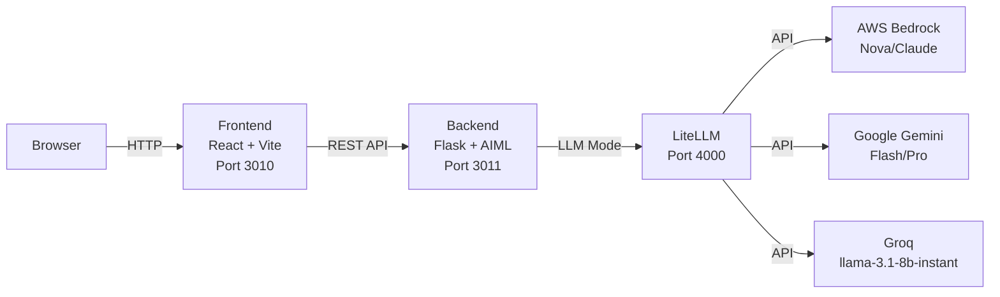

# Hybrid AI AIML Chat

A hybrid chatbot that combines AIML patterns with LLM responses, featuring a React frontend and Python Flask backend.

## TL;DR

This project demonstrates a cost-effective approach to chatbot development by combining traditional AIML pattern matching with modern LLM capabilities. The hybrid mode uses AIML for common queries (fast and free) and falls back to LLM only when needed, significantly reducing token usage and costs.

### Token Usage Comparison (from tests)
- **LLM Mode**: 45,334 tokens
- **Hybrid Mode (no compression)**: 7,587 tokens (83% reduction)

The hybrid approach saves ~83% in token costs compared to pure LLM mode.


## Features
- **3 Chat Modes**:
  - **AIML**: Traditional pattern-based responses
  - **LLM**: AI-powered responses via LiteLLM
  - **Hybrid**: Smart combination (AIML first, LLM fallback)
- **Backend**: Python Flask server on port 3011 with multi-mode support
- **Frontend**: React + Vite application on port 3010 with mode switching
- **LiteLLM Integration**: Connects to LiteLLM running on Kubernetes
- **Kubernetes and Docker Support**: Full containerization (docker compose ot helm)


## Quick Start

### Prerequisites 
You **MUST** have the following installed and configured before installing the bot:
- **LiteLLM** running on Kind/Kubernetes in `lite-llm` namespace (or accessible endpoint)
- **kubectl** configured to access your cluster (for Kubernetes deployment)
- **Docker** and **Docker Compose** (for local deployment)
- **Helm 3.x** (for Kubernetes deployment)

### Option 1: Kubernetes (Recommended)

Install using Helm chart:
```bash
helm upgrade --install my-chatbot https://github.com/elevy99927/hybrid-ai-aiml-chat/releases/download/helm-chart-v1.0.1/hybrid-chatbot-1.0.1.tgz
```

Or with custom values:
```bash
helm upgrade --install hybrid-bot ./helm/hybrid-chatbot/ -f ./helm/hybrid-chatbot/values.yaml
```

See [Helm Chart Documentation](helm/QUICKSTART.md) for more details.

### Option 2: Docker Compose (Local Development)

1. Configure LiteLLM port-forward:
```bash
kubectl port-forward -n lite-llm svc/lite-helm-litellm 8080:4000
```

2. Start the application:
```bash
docker compose up -d
```

3. Access the chatbot at `http://localhost:3010`


## Chat Modes

### AIML Mode 
- Uses traditional AIML pattern matching
- Fast, deterministic responses
- No token costs
- Good for structured conversations and FAQs
- 100+ pre-loaded AIML patterns

### LLM Mode  
- Uses LiteLLM for AI-powered responses
- Creative, contextual responses
- Requires LiteLLM service
- Supports multiple LLM providers (AWS Bedrock, Google Gemini, etc.)
- Optional token compression with LLMLingua-2

### Hybrid Mode (Recommended)
- Tries AIML patterns first
- Falls back to LLM for unmatched inputs
- Best of both worlds: speed + intelligence
- 83% token cost reduction vs pure LLM mode

## Configuration

### Environment Variables

All configuration is done via environment variables (see `docker-compose.yml` or Helm `values.yaml`):

#### LiteLLM Configuration
- `LITELLM_BASE_URL` - LiteLLM service endpoint (default: `http://host.docker.internal:8080`)
- `LITELLM_API_KEY` - API key for LiteLLM authentication
- `LITELLM_MODEL` - Model to use (e.g., `eu.amazon.nova-2-lite-v1:0`, `gemini/gemini-2.0-flash-lite-001`)
- `LITELLM_MAX_CONTEXT_TOKENS` - Maximum context window size (default: `3000`)
  - Controls how much conversation history is sent to the LLM
  - Higher values = more context but higher costs
- `LITELLM_MAX_COMPLETION_TOKENS` - Maximum response length (default: `250`)
  - Limits the length of LLM responses
  - Prevents runaway token usage

#### LLMLingua Compression (Optional)
- `LLMLINGUA_MODEL` - Compression model (default: `microsoft/llmlingua-2-bert-base-multilingual-cased-meetingbank`)
- `LLMLINGUA_DEVICE` - Device for compression (`cpu` or `cuda`)
- `DEBUG_LLMLINGUA` - Enable compression debugging (`true`/`false`)

#### System Configuration
- `LITELLM_SYSTEM_PROMPT` - Custom system prompt for LLM (optional)
- `DEBUG` - Enable debug logging (`true`/`false`)

### Kubernetes Configuration

For Kubernetes deployment, configure these values in your Helm values file:

```yaml
backend:
  litellm:
    baseUrl: "http://lite-helm-litellm.lite-llm.svc.cluster.local:4000"
    apiKey: "your-api-key"
    model: "eu.amazon.nova-2-lite-v1:0"
    maxContextTokens: 3000
    maxCompletionTokens: 250
```

See [helm/hybrid-chatbot/values.yaml](helm/hybrid-chatbot/values.yaml) for all available options.


## AIML
Artificial Intelligence Markup Language (**AIML**) is an **XML-based** scripting language used to create natural language software agents, primarily for chatbots and conversational AI. Developed between 1995 and 2002, it was designed to power the **A.L.I.C.E.** (Artificial Linguistic Internet Computer Entity)


### AIML Files
The bot comes with 100+ pre-loaded AIML patterns covering various topics:
- Casual conversation and greetings
- Questions and general knowledge
- Emotions and personality

### Adding Custom Patterns

Add your own AIML patterns to `src/backend/data/`:
1. Create a new `.aiml` or `.xml` file
2. Follow AIML 1.0 syntax
3. Rebuild the Docker image or restart the pod

Example pattern:
```xml
<aiml version="1.0">
  <category>
    <pattern>HELLO</pattern>
    <template>Hi there! How can I help you?</template>
  </category>
</aiml>
```

### AIML Pattern Sources
AIML patterns sourced from: https://github.com/hartez/XmppBot-AIML/tree/master


This builds multi-platform images (amd64/arm64) and pushes to Docker Hub.

### Running Tests

Scripted test with 50 pre-defiend questions is located in `prompts/full-chat.md`
Test the chatbot with different modes:
```bash
# Test LLM mode
python scripts/test-chat.py --mode LLM

# Test Hybrid mode
python scripts/test-chat.py --mode Hybrid


```


This creates a git tag and packages the chart for GitHub releases.

## Architecture



## Troubleshooting

### Frontend can't connect to backend
- Check that backend is running: `curl http://localhost:3011/`
- Verify backend URL in frontend configuration
- For Kubernetes: ensure services are properly configured

### LLM mode not working
- Verify LiteLLM is accessible: `curl http://your-litellm-url/health`
- Check API key and model configuration
- Review backend logs for connection errors

### High token usage
- Use Hybrid mode instead of pure LLM mode
- Enable compression with `--compress` flag
- Reduce `LITELLM_MAX_CONTEXT_TOKENS` value
- Add more AIML patterns for common queries


## Links

- [Helm Chart Documentation](helm/QUICKSTART.md)
- [Docker Hub - Frontend](https://hub.docker.com/r/elevy99927/hybrid-ai-aiml-chat-frontend)
- [Docker Hub - Backend](https://hub.docker.com/r/elevy99927/hybrid-ai-aiml-chat-backend)
- [GitHub Releases](https://github.com/elevy99927/hybrid-ai-aiml-chat/releases)


## License

MIT License

## Contributing

Contributions are welcome! Please feel free to submit a Pull Request.

## Contact
For questions or feedback, feel free to reach out:

- **Email:** eyal@levys.co.il
- **GitHub:** https://github.com/elevy99927